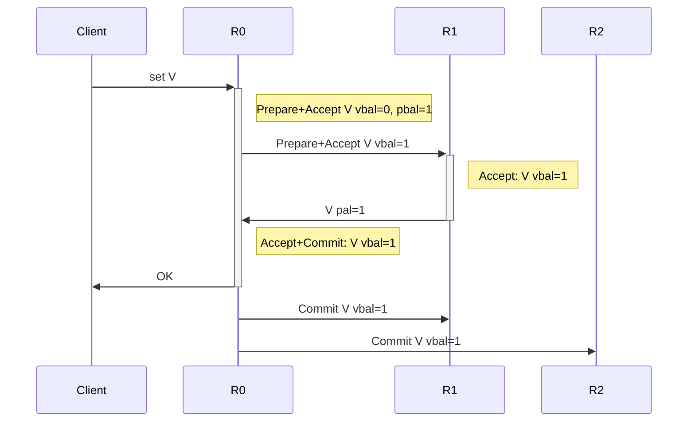
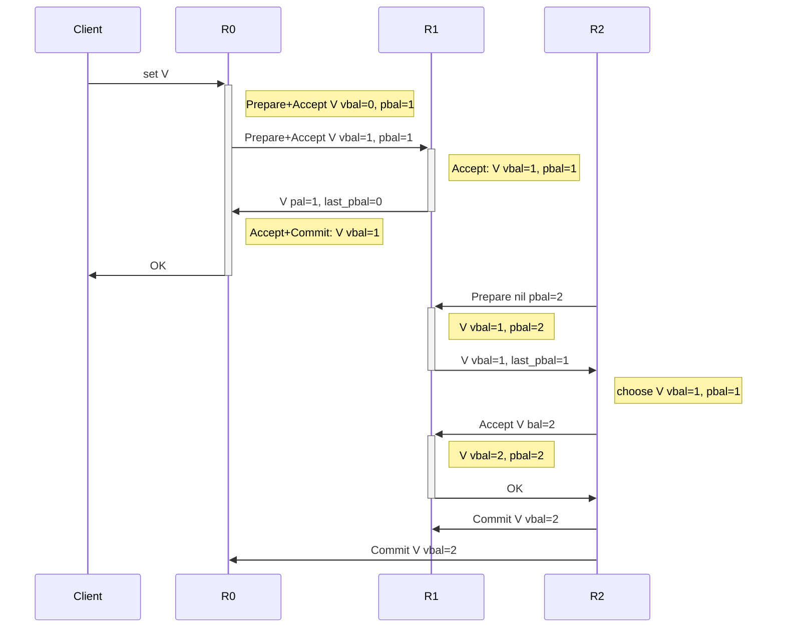
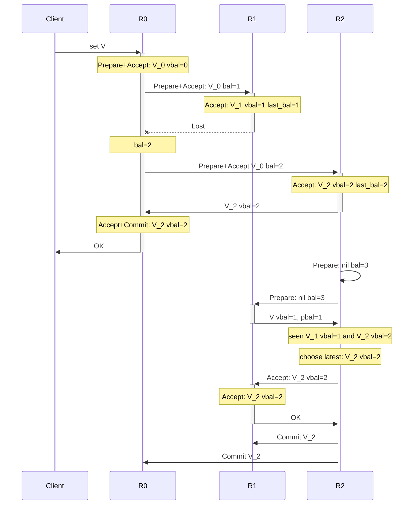
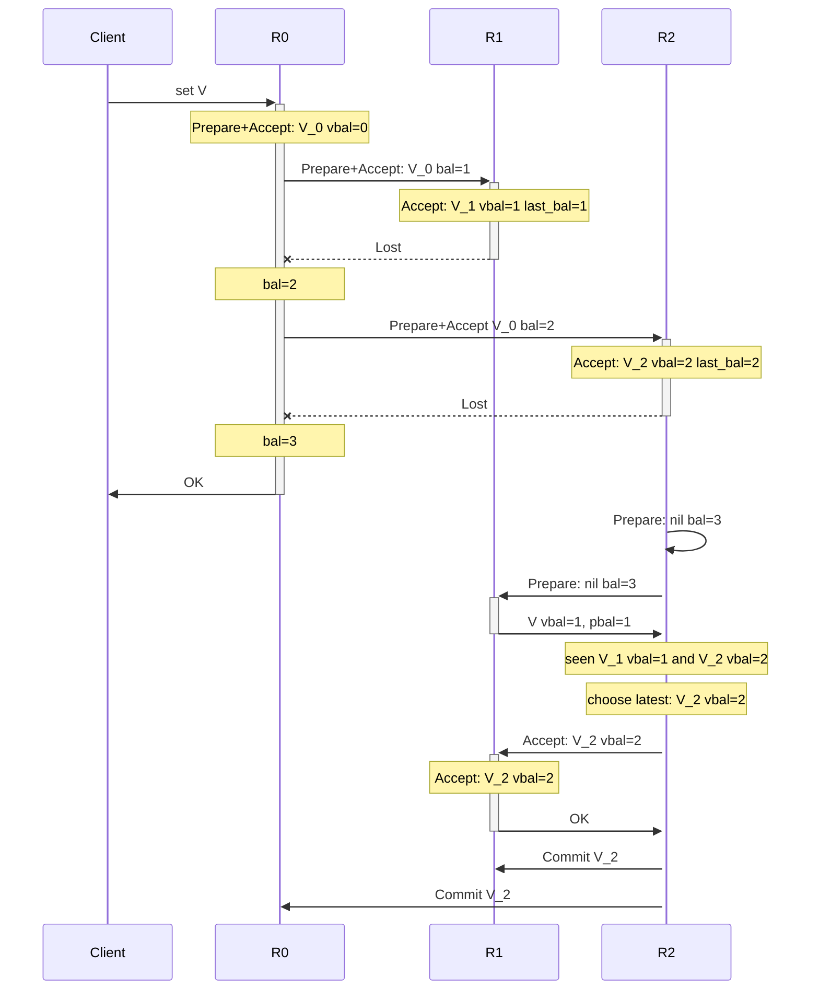

# paxoskv: a Naive and Basic paxos kv storage


[](https://travis-ci.com/openacid/paxoskv)

- Prepare: soft update knows, write instance with VBal=0 and Bal > 0
- Accept: override knows

compare with `Vbal, Bal, `

instance operation:

prepare(inst, bal)

### Propose



### Repair

Recovery send Prepare without value and do not accept.



### Repair after re-send



## Instance status

- on leader: accepted vbal=0
- on leader: committed
- other: nil
- other: accepted vbal > 0
- other: committed



# membership change

- start x as a learner, i.e., just collect commit instances and apply them, do
  not propose new instance or vote.
- propose a change cmd, e.g. (`abc->xbc`), commit and apply it. Nothing happens
  before applying it.
- When applied, a stops accept new proposal, but continue commit present
  instances. A client receives error message then retry on x
- When applied, a,b,c sends all instances to x. when x contact a quorum of abc,
  it starts to work.

todo tla+

这个 repo 目前仅是用于学习的实例代码.

这是一个基于 paxos, 只有 200 行代码的 kv 存储系统的简单实现, 以最简洁的形式展示
paxos 如何运行, 作为 [可靠分布式系统-paxos 的直观解释][] 这篇教程中的代码示例部
分.

因为有不少网友跟我问起这篇教程中的实现问题, 例如怎么把只能确定一个值的 paxos 应
用到实际场景中. 既然**Talk is cheap**, 那么就**Show me the code**, 把教程中描述
的内容直接用代码实现出来, 希望能覆盖到教程中的每个细节. 帮助大家理解 paxos 的运
行机制.

NB-paxoskv 通过 classic paxos 建立一个简单的 kv 存储, 这个版本只支持指定
key-version 的写入和读取:

- 写入操作通过一次 2 轮的 paxos 实现.

- 读取操作也通过一次 1 轮或 2 轮的 paxos 实现.

- 虽然每个 key 支持更新(通过多个 ver), 但在这个版本的代码中只能通过指定 ver 的方
  式写入, 目前还不支持把对 key 的更新自动作为下一个 ver 来写入(不似生产环境 kv
  存储的实现).

- 没有以状态机的方式实现 WAL and compaction 的存储, 它直接把 paxos instance 对应
  到 key 的每个版本上.

# 名词

在 paxos 相关的 paper, [可靠分布式系统-paxos 的直观解释][], 以及这个 repo 中代码
涉及到的各种名词, 下面列出的都是等价的:

```
rnd == bal == BallotNum ~= Ballot
quorum == majority == 多数派
voted value == accepted value // by an acceptor
```

# Usage

跑测试: `GO111MODULE=on go test ./...`.

重新 build proto 文件(如果宁想要修改下玩玩的话): `make gen`.

数据结构使用 protobuf 定义; RPC 使用 grpc 实现;

# 目录结构

- `proto/paxoskv.proto`: 定义 paxos 相关的数据结构.

- `paxoskv/`:

  - `impl.go`: 206 行代码实现的 paxos 协议:

    - 实现 paxos Acceptor 的`Prepare()`和`Accept()`这两个 request handler;
    - 实现 Proposer 的功能: 执行`Phase1()`和`Phase2()`,
    - 以及完整运行一次 paxos 的`RunPaxos()`方法;
    - 实现一个 kv 纯内存的存储, 每个 key 有多个 version, 每个 version 对应一个
      paxos instance;
    - 以及启动 n 个 Acceptor 的 grpc 服务函数

  - `paxos_slides_case_test.go`: 按照 [可靠分布式系统-paxos 的直观解释][] 给出的
    两个例子([slide-32][]和[slide-33][]), 调用 paxos 接口来模拟这 2 个场景中的
    paxos 运行.

  - `example_set_get_test.go`: 使用 paxos 提供的接口实现指定 key 和 ver 的写入和
    读取.

Change: multi paxos

Log and snapshot

Key-ver to log

global LastBal now is a server attr

Proposer 不再维护 paxosId

# Question

如果有任何问题, 欢迎提[issue] :DDD.

[issue]: https://github.com/openacid/paxoskv/issues/new/choose
[可靠分布式系统-paxos的直观解释]: https://blog.openacid.com/algo/paxos/
[slide-32]: https://blog.openacid.com/algo/paxos/#slide-32
[slide-33]: https://blog.openacid.com/algo/paxos/#slide-33
