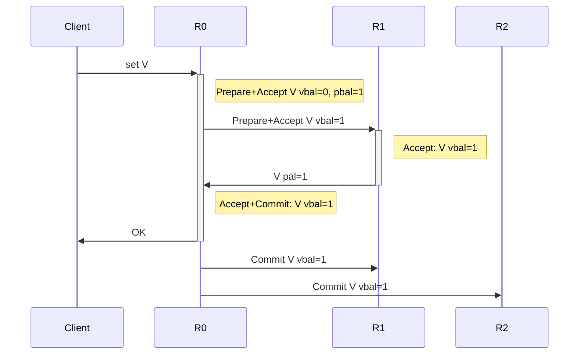
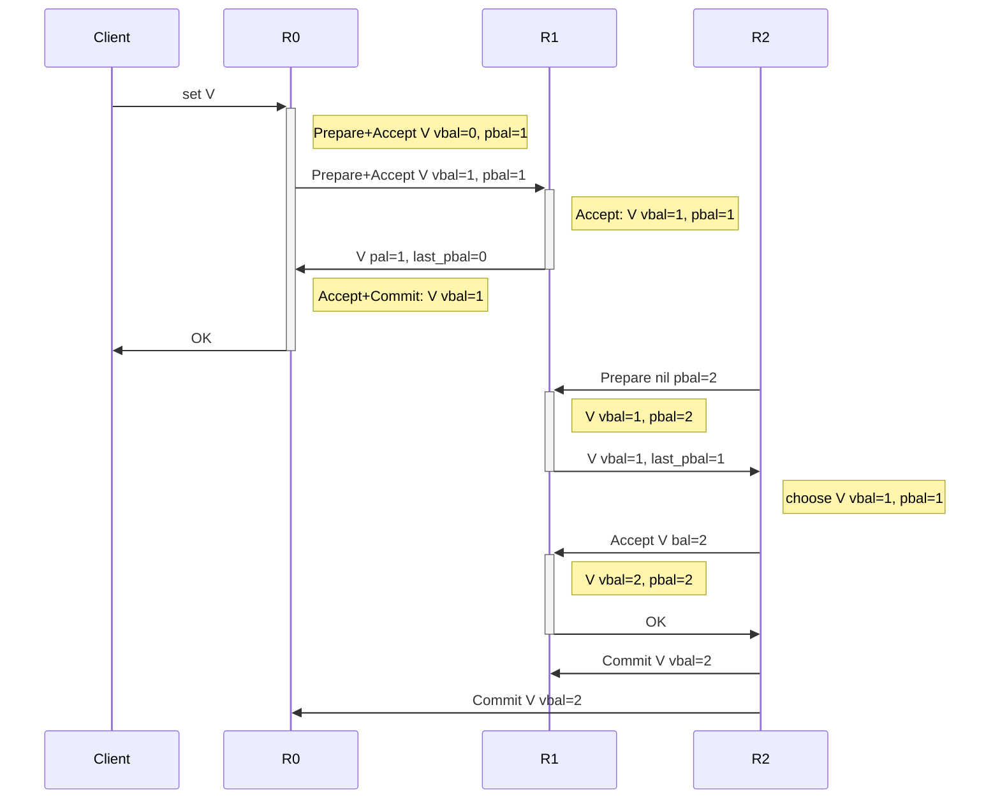
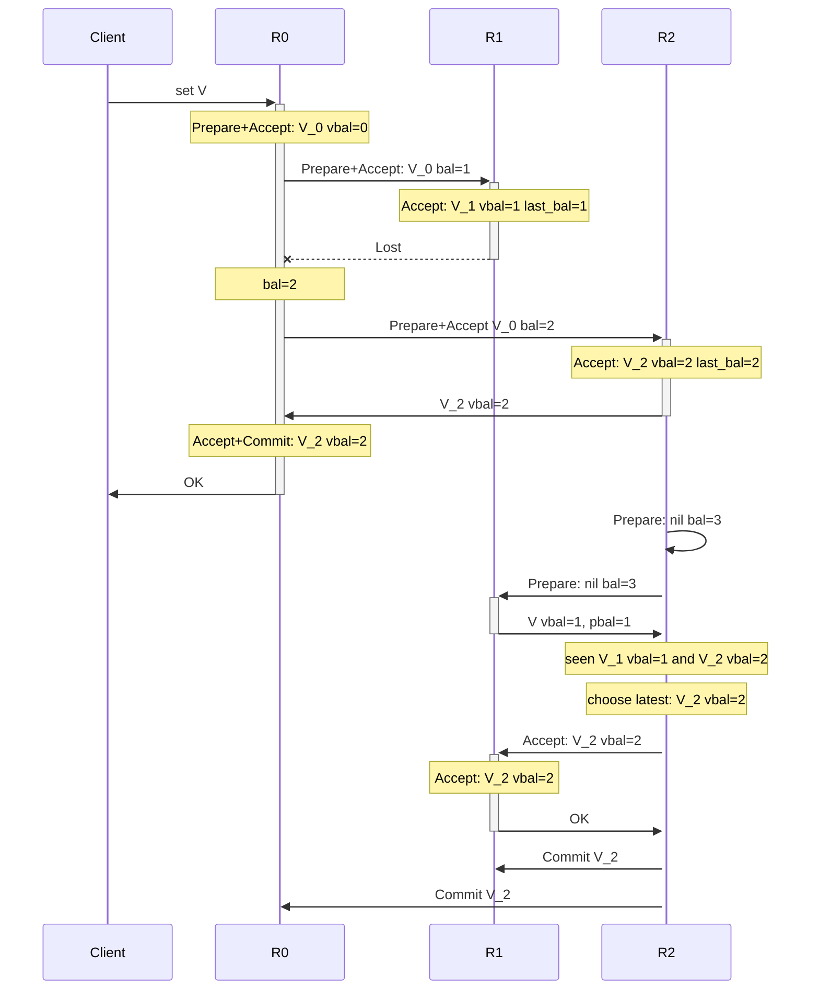
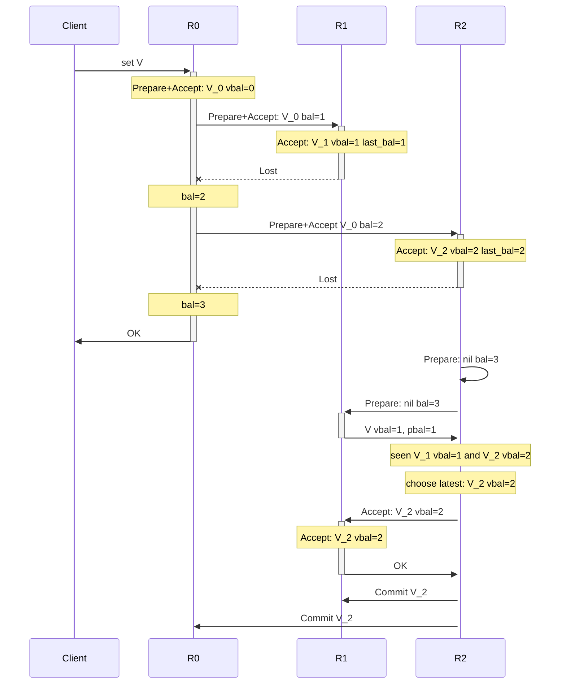

# paxoskv: a Naive and Basic paxos kv storage


[](https://travis-ci.com/openacid/paxoskv)


- Prepare: soft update knows, write instance with VBal=0 and Bal > 0
- Accept: override knows

compare with `Vbal, Bal, `

instance operation:

prepare(inst, bal)

### Propose



### Repair

Recovery send Prepare without value and do not accept.



### Repair after re-send



## Instance status

- on leader: accepted vbal=0
- on leader: committed
- other: nil
- other: accepted vbal > 0
- other: committed




# membership change

- start x as a learner, i.e., just collect commit instances and apply them, do not propose new instance or vote.
- propose a change cmd, e.g. (`abc->xbc`), commit and apply it. Nothing happens before applying it.
- When applied, a stops accept new proposal, but continue commit present instances. A client receives error message then retry on x
- When applied, a,b,c sends all instances to x. when x contact a quorum of abc, it starts to work.

todo tla+


# apply with SCC

A straight forward algo to determine the apply order in a DAG is to find SCC recursively:
E.g., ABC is an SCC and XY is another.
This algo apply XY then ABC.
In every SCC, determine the order by some attribute such as ord:

```
A -> B -> X -> Y
^    |    ^    |
|    v     `---'
'--- C

```

If x is proposed after y is committed, then x sees y and y does not seen x,
which implies y.Seen is a sub set of x.Seen.

# apply with partial SCC

```

x      y      z
a      b      c
----------------
C0     C1     C2    // 3 log column on one server

```

# apply without SCC

```

x      y      z
a      b      c
----------------
C0     C1     C2    // 3 log column on one server
```

If instanes are in an SCC, apply them in any deterministic order is correct.
If x is not in SCC, x depends on all instances in SCC or none.

if x is proposed after y is committed: 
=> |x.deps| >= |y.deps| 

.: apply instances in the order of number of deps guarantees linearizability.


## Lemma-cycle

if x depends on y and x.ord < y.ord:
then there is a cycle x->y->..x

x.ord < y.ord
=> x.vc <= y.vc
=> x.seen[i] == y.seen[i] for any i => y depends on x
   or there exists an i so that x.seen[i] < y.seen[i] => y.seen[i] depends on x


## proof

if x.ord > y.ord, no matter whether x and y is in a cycle or not, y will be applied first.

if x.ord < y.ord: there is a cycle x->y->..->x by Lemma-cycle.
    if x is the first to apply in a SCC. it is ok.
    if another instance z is the first to apply:
        if y depends on z, z will be found.
        otherwise, there is a cycle z->y->..->z
        The problem is reduced to: by going through min-ord path, the first inst to run can be find from y.
        Then repeat the alog will find z.

## differences

SCC removes vertexes that can not be applied first, then consider relations between the lowest vertexes.
It actually gets rid of some of the relation.

VC 

Both of them are correct: x proposed after y is committed always execute after y.

E.g.:

SCC chooses 36 first
VC choose 54 first

Because by considering only the lowest, the graph is:
`54 -> 36`

```
         39 <.
.------> 38  |
|            |
|         .--'
54       36  --.
 '-------|---> '-> 44 
         |
53 <-----'
_________________

```

这个repo 目前仅是用于学习的实例代码.

这是一个基于paxos, 只有200行代码的kv存储系统的简单实现, 以最简洁的形式展示paxos如何运行, 作为 [可靠分布式系统-paxos的直观解释][] 这篇教程中的代码示例部分.

因为有不少网友跟我问起这篇教程中的实现问题, 例如怎么把只能确定一个值的paxos应用到实际场景中.
既然**Talk is cheap**, 那么就**Show me the code**, 把教程中描述的内容直接用代码实现出来, 希望能覆盖到教程中的每个细节. 帮助大家理解paxos的运行机制.

NB-paxoskv 通过classic paxos建立一个简单的kv存储,
这个版本只支持指定key-version的写入和读取:

- 写入操作通过一次2轮的paxos实现.

- 读取操作也通过一次1轮或2轮的paxos实现.

- 虽然每个key支持更新(通过多个ver),
    但在这个版本的代码中只能通过指定ver的方式写入,
    目前还不支持把对key的更新自动作为下一个ver来写入(不似生产环境kv存储的实现).

- 没有以状态机的方式实现 WAL and compaction的存储, 它直接把paxos instance对应到key的每个版本上.

# 名词

在paxos相关的paper, [可靠分布式系统-paxos的直观解释][],
以及这个repo中代码涉及到的各种名词, 下面列出的都是等价的:

```
rnd == bal == BallotNum ~= Ballot
quorum == majority == 多数派
voted value == accepted value // by an acceptor
```

# Usage

跑测试: `GO111MODULE=on go test ./...`.

重新build proto文件(如果宁想要修改下玩玩的话): `make gen`.

数据结构使用protobuf 定义; RPC使用grpc实现;


# 目录结构

- `proto/paxoskv.proto`: 定义paxos相关的数据结构.

- `paxoskv/`:

    - `impl.go`: 206行代码实现的paxos协议:
        - 实现paxos Acceptor的`Prepare()`和`Accept()`这两个request handler;
        - 实现Proposer的功能: 执行`Phase1()`和`Phase2()`,
        - 以及完整运行一次paxos的`RunPaxos()`方法;
        - 实现一个kv纯内存的存储, 每个key有多个version, 每个version对应一个paxos instance;
        - 以及启动n个Acceptor的grpc服务函数

    - `paxos_slides_case_test.go`: 按照 [可靠分布式系统-paxos的直观解释][] 给出的两个例子([slide-32][]和[slide-33][]), 调用paxos接口来模拟这2个场景中的paxos运行.

    - `example_set_get_test.go`: 使用paxos提供的接口实现指定key和ver的写入和读取.


Change:
multi paxos


Log and snapshot

Key-ver to log

global LastBal now is a server attr

Proposer 不再维护paxosId


# Question

如果有任何问题, 欢迎提[issue] :DDD.


[issue]:                          https://github.com/openacid/paxoskv/issues/new/choose
[可靠分布式系统-paxos的直观解释]: https://blog.openacid.com/algo/paxos/
[slide-32]:                       https://blog.openacid.com/algo/paxos/#slide-32
[slide-33]:                       https://blog.openacid.com/algo/paxos/#slide-33
